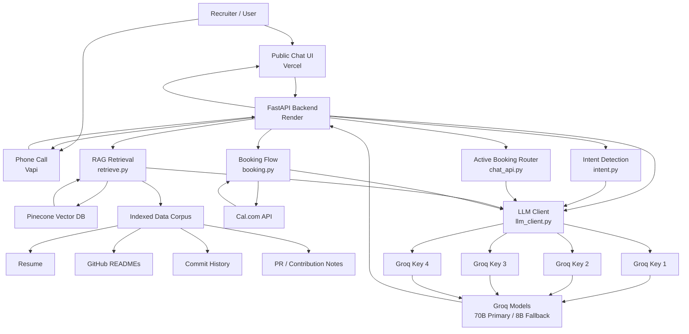
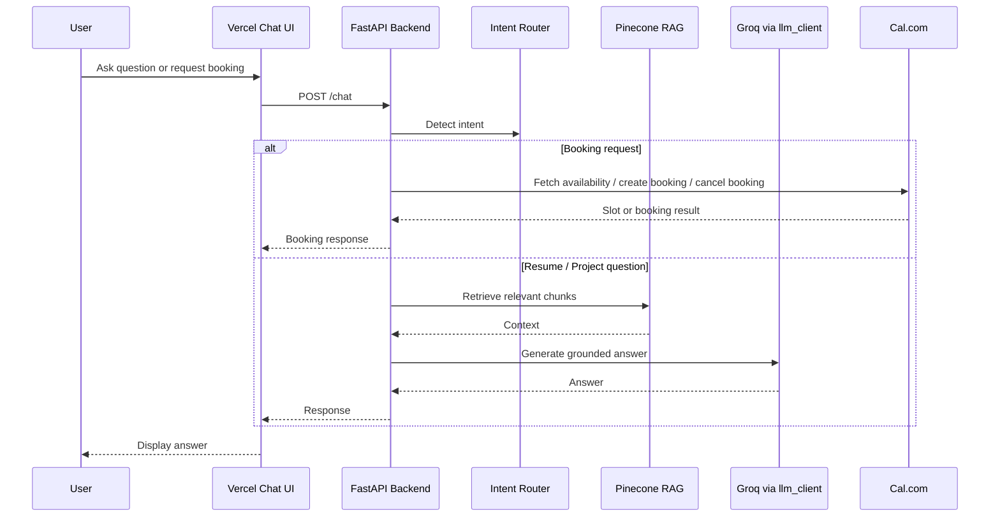
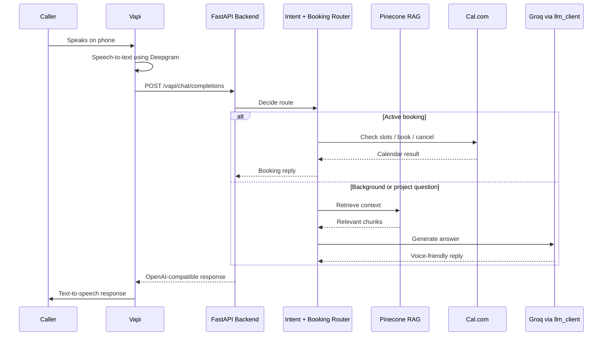

# Gaurav Saklani AI Persona

An end-to-end AI persona built for the **Scaler AI Engineer Intern Screening Assignment**.

The system allows recruiters to interact with Gaurav Saklani’s AI representative through both:

* A public chat interface
* A phone-call based voice agent

The persona can answer questions about Gaurav’s resume, education, projects, GitHub repositories, achievements, and role fit. It is grounded using RAG over Gaurav’s resume, GitHub README files, commit history, and contribution data. It can also check real calendar availability and book or cancel interviews using Cal.com.

---

## Live Links

| Item                     | Link                                      |
| ------------------------ | ----------------------------------------- |
| Public Chat URL          | https://scaler-ai-persona-phi.vercel.app/ |
| Voice Agent Phone Number | +1669268XXXX                              |

---

## Features

### Chat Interface

* Answers questions about Gaurav’s background, education, skills, projects, GitHub repositories, and achievements.
* Uses RAG over real resume and GitHub data.
* Supports follow-up questions using conversation history.
* Can schedule and cancel interviews directly from chat.
* Handles adversarial prompts and refuses to invent unverified information.

### Voice Agent

* Public phone number powered by Vapi.
* Introduces itself as Gaurav Saklani’s AI representative.
* Handles natural conversation, interruptions, and off-script questions.
* Can answer role-fit, project, and resume questions.
* Can ask availability, fetch real Cal.com slots, confirm booking, and cancel bookings.
* Uses stricter booking-stage validation to avoid accidental booking/cancellation errors.

### Booking System

* Uses Cal.com v2 APIs for real availability and booking.
* Shows real available slots.
* Collects attendee name and email.
* Confirms details before creating a calendar booking.
* Supports cancellation with reason.
* Keeps booking state per session.

### Reliability

* Uses a shared `llm_client.py` with 4 Groq API key fallback.
* Uses primary and fallback Groq models.
* Prevents raw Groq rate-limit errors from being shown to users.
* Uses an UptimeRobot-compatible `/health` endpoint with both `GET` and `HEAD`.

---

## Architecture



---

## High-Level Flow

### Chat Flow



### Voice Flow



---

## Tech Stack

### Frontend

* HTML
* CSS
* Vanilla JavaScript
* Vercel deployment
* Runtime API config using generated `config.js`

### Backend

* Python
* FastAPI
* Uvicorn
* Render deployment
* Pydantic
* HTTPX

### AI / LLM

* Groq API
* `llama-3.3-70b-versatile` for high-quality main answers
* `llama-3.1-8b-instant` for intent routing, extraction, and fallback
* Multi-key fallback through `llm_client.py`

### RAG

* Pinecone vector database
* FastEmbed embeddings
* Resume + GitHub README + commits + PR/contribution data
* Smart retrieval for chat and voice contexts

### Voice

* Vapi
* Deepgram transcription
* Vapi voice
* Phone number attached to assistant

### Calendar

* Cal.com v2 API
* Real slot fetching
* Real booking confirmation
* Cancellation with reason

---

## Repository Structure

```text
scaler-ai-persona/
├── backend/
│   ├── chat_api.py
│   ├── booking.py
│   ├── intent.py
│   ├── retrieve.py
│   ├── llm_client.py
│   ├── parse_data.py
│   ├── embed_and_upsert.py
│   ├── requirements.txt
│   ├── .python-version
│   └── data/
│       ├── resume/
│       ├── repos/
│       └── processed/
│
├── frontend/
│   ├── index.html
│   ├── generate-config.js
│   ├── package.json
│   └── vercel.json
│
├── README.md
└── .gitignore
```

> Note: the `data/` folder is excluded from GitHub because it contains local processed data. Pinecone stores the deployed vector index.

---

## Environment Variables

### Backend `.env`

```env
# Groq multi-key fallback
GROQ_API_KEY_1=your_first_groq_key
GROQ_API_KEY_2=your_second_groq_key
GROQ_API_KEY_3=your_third_groq_key
GROQ_API_KEY_4=your_fourth_groq_key

GROQ_MODEL=llama-3.3-70b-versatile
GROQ_FALLBACK_MODEL=llama-3.1-8b-instant
GROQ_ROUTER_MODEL=llama-3.1-8b-instant
CONTACT_EXTRACTION_MODEL=llama-3.1-8b-instant
INTENT_MODEL=llama-3.1-8b-instant

# Pinecone
PINECONE_API_KEY=your_pinecone_key

# Cal.com
CAL_API_KEY=your_cal_api_key
CAL_EVENT_TYPE_ID=your_event_type_id
CAL_USERNAME=gaurav-saklani
```

### Frontend Vercel Environment Variable

```env
API_URL=https://scaler-ai-persona-o9om.onrender.com/chat
```

---

## Local Setup

### 1. Clone the repo

```bash
git clone ADD_YOUR_REPO_URL_HERE
cd scaler-ai-persona
```

### 2. Backend setup

```bash
cd backend
python -m venv venv
source venv/bin/activate
pip install -r requirements.txt
```

On Windows PowerShell:

```powershell
cd backend
python -m venv venv
.\venv\Scripts\activate
pip install -r requirements.txt
```

### 3. Add environment variables

Create:

```text
backend/.env
```

Add the backend environment variables listed above.

### 4. Run backend locally

```bash
uvicorn chat_api:app --host 0.0.0.0 --port 8000
```

Test:

```bash
curl http://localhost:8000/health
```

---

## Data Pipeline

### 1. Prepare data

The local data folder contains:

```text
data/
├── resume/
│   └── resume.txt
├── repos/
│   ├── personal/
│   └── contributed/
└── processed/
```

Each repository folder contains selected README, commits, and contribution data.

### 2. Parse data

```bash
python parse_data.py
```

This creates:

```text
data/processed/parsed_chunks.json
```

### 3. Embed and upsert to Pinecone

```bash
python embed_and_upsert.py
```

This creates or updates the Pinecone index:

```text
Index: ai-persona-local
Namespace: gaurav-ai-persona
```

---

## API Endpoints

### Health

```http
GET /health
HEAD /health
```

Used by UptimeRobot and deployment checks.

### Chat

```http
POST /chat
```

Request:

```json
{
  "message": "Tell me about Gaurav's AI projects",
  "session_id": "test-session",
  "history": []
}
```

### Voice

```http
POST /voice
```

Request:

```json
{
  "message": "Why is Gaurav fit for this role?",
  "session_id": "voice-test"
}
```

### Vapi Custom LLM

```http
POST /vapi/chat/completions
POST /vapi
POST /chat/completions
```

These endpoints support Vapi’s Custom LLM / OpenAI-compatible format.

---

## Deployment

### Backend on Render

Render settings:

```text
Root Directory: backend
Runtime: Python
Build Command: pip install -r requirements.txt
Start Command: uvicorn chat_api:app --host 0.0.0.0 --port $PORT
```

Python version:

```text
3.11.9
```

Health URL:

```text
https://scaler-ai-persona-o9om.onrender.com/health
```

### Frontend on Vercel

Vercel settings:

```text
Root Directory: frontend
Framework Preset: Other
Build Command: npm run build
Output Directory: .
```

The frontend uses `generate-config.js` to create `config.js` during build:

```js
window.APP_CONFIG = {
  API_URL: "https://scaler-ai-persona-o9om.onrender.com/chat"
};
```

---

## Vapi Configuration

### Model Settings

```text
Provider: Custom LLM
Model: gaurav-ai-persona
Custom LLM URL: https://scaler-ai-persona-o9om.onrender.com/vapi
Temperature: 0.3
Max Tokens: 220
```

### First Message

```text
Hi, I’m Gaurav Saklani’s AI representative. I can answer questions about his background, projects, GitHub work, and availability, and I can help schedule an interview.
```

### Transcriber

```text
Provider: Deepgram
Model: Flux General English
Language: English
Smart Endpointing: Off
End of Turn Timeout: around 1600ms
```

### Phone Number

```text
+16692680328
```

---

## Reliability Improvements

### Multi-Key Groq Fallback

All LLM calls go through `llm_client.py`.

This prevents one exhausted key from breaking the full application.

### Booking State Protection

The booking flow uses state-based handling.

Critical booking stages bypass general routing:

```text
collecting_info
awaiting_confirmation
cancel_reason
cancel_confirming
```

This prevents a cancellation reason or attendee email from being misclassified as a normal chat message.

### Active Booking Pause

During booking, the user can ask a normal question such as:

```text
Tell me about Vocalis first.
```

The system can pause booking, answer using RAG, and then continue the booking flow.

---

## Cost Breakdown

The system was designed to stay low-cost during testing by using free-tier hosting where possible and keeping LLM calls short for both chat and voice.

### Fixed / Hosting Cost

| Component   | Usage in this project                            | Expected cost for assignment testing  |
| ----------- | ------------------------------------------------ | ------------------------------------- |
| Vercel      | Hosts the public chat frontend                   | Free tier                             |
| Render      | Hosts the FastAPI backend                        | Free tier                             |
| Pinecone    | Stores the small RAG vector index                | Free/serverless usage for small index |
| Cal.com     | Checks availability and creates bookings         | Free for this use case                |
| UptimeRobot | Keeps backend warm using `/health`               | Free tier                             |
| Groq        | LLM inference for routing and final answers      | Free/on-demand tier during testing    |
| Vapi        | Phone number, call orchestration, voice pipeline | Usage-based voice call cost(10$ credit is free)         |

### Approximate Per-Chat Session Cost

A normal chat session usually includes:

```text
1 Pinecone retrieval query
1 Groq call for final answer
Optional small Groq calls for intent/contact extraction during booking
```

Observed assignment usage was effectively covered by free tiers. For a typical 5-message chat session, the practical cost is very low because the main paid components are only token usage and vector queries.

```text
Estimated chat session cost during testing: ~free to a few cents
Main cost drivers: number of LLM tokens, number of chat turns, and retrieval calls
```

### Approximate Per-Voice Call Cost

A voice call uses more services than chat because it includes speech-to-text, LLM response generation, and text-to-speech.

Observed Vapi dashboard metrics during testing:

```text
Average first-response latency: ~450 ms
Average voice cost: ~0.08 USD per minute
```

Example cost estimate:

```text
2-minute call  ≈ 0.16 USD
3-minute call  ≈ 0.24 USD
5-minute call  ≈ 0.40 USD
```

Additional Groq and Pinecone usage was small compared with the voice pipeline cost during test calls.

### Booking Cost

Booking itself does not add a separate major infrastructure cost. It uses:

```text
Cal.com API calls for availability and booking
Small Groq calls for extracting/confirming name, email, and time
```

For assignment-scale usage, booking cost is negligible compared with voice call minutes.

---

## Evaluation Snapshot

### Voice

* Test calls: 12
* Successful bookings: 8/12
* Task completion rate: 66.7%
* Average first-response latency: ~450 ms
* Main issues: email spelling, date/time confusion, and interruptions during booking

### Chat / RAG

* Golden Q&A tested: 40 questions
* Correct grounded answers: 32/40
* Grounded accuracy: 80%
* Hallucinations: 3/40
* Hallucination rate: 7.5%
* Retrieval: top 5 chunks from resume, GitHub README, commits, and PR/contribution data

---

## Known Failure Modes and Fixes

### 1. Voice transcription misunderstood booking slot choices

**Root cause:** speech-to-text sometimes produced unclear slot/date phrases.

**Fix:** stricter slot validation. After slots are shown, the user must choose a shown option or ask for more slots.

### 2. Cancellation reason was mistaken as stopping the booking flow

**Root cause:** active booking router intercepted messages during cancellation stages.

**Fix:** strict booking stages now go directly to `booking.py`, bypassing general route classification.

### 3. Booking flow got interrupted by project or background questions

**Root cause:** users do not always follow a fixed booking sequence. They may start booking, ask about a project, and then return to scheduling.

**Fix:** added an active booking router with state tracking, so the system can pause booking, answer the normal query, and continue from the same booking state later.

---

## Author

**Gaurav Saklani**
B.Tech CSE with AI/ML Specialization
Graphic Era Hill University, Dehradun

GitHub: https://github.com/git-gauravtech
LinkedIn: https://linkedin.com/in/gaurav-saklani-06a17a300
